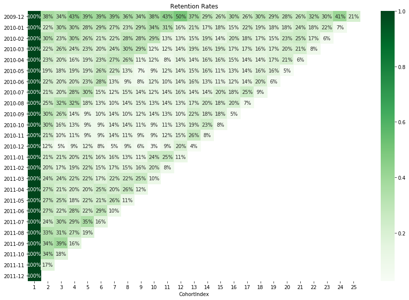

# Cohort Analysis

Cohort Analysis allows to track user behavior over time and is the stepping stone in calculating **retention rates**.

## Installation
- Python 3.7.3
- Data: [Online Retail II Data Set, UCI Machine Learning Repository](http://archive.ics.uci.edu/ml/datasets/Online+Retail+II)
- Libraries: pandas, NumPy, Matplotlib, Seaborn

## File Descriptions
Because the dataset is large and publicly available, I did not upload it here. 

The analysis can be found as Jupyter Notebook here:

* [cohort_analysis.ipynb](https://github.com/k-bosko/cohort_analysis/blob/master/cohort_analysis.ipynb)

## Project Description
In this project, I analyzed customer behavior for online retail store that sells unique all-occasion gift-ware in the UK. 

The dataset consists of 1,067,371 transactions and has the following variables:

| Variable | Description |
| :--- | :--- |
| **InvoiceNo** | Invoice number. Nominal. A 6-digit integral number uniquely assigned to each transaction. If this code starts with the letter 'c', it indicates a cancellation.|
| **StockCode** | Product (item) code. Nominal. A 5-digit integral number uniquely assigned to each distinct product.  
| **Description** | Product (item) name. Nominal.|
| **Quantity** | The quantities of each product (item) per transaction. Numeric.|
| **InvoiceDate** | Invice date and time. Numeric. The day and time when a transaction was generated. |
| **UnitPrice** | Unit price. Numeric. Product price per unit in sterling. |
| **CustomerID** | Customer number. Nominal. A 5-digit integral number uniquely assigned to each customer.|
| **Country** | Country name. Nominal. The name of the country where a customer resides.|

I created cohorts based on monthly data between years 2009 and 2011, calculated **retention rates** and visualized them via a heatmap.

## Results

## Acknowledgement
This project is part of ["Customer Segmentation in Python" course on Data Camp](https://learn.datacamp.com/courses/customer-segmentation-in-python) taught by Karolis Urbonas, Global Head of Machine Learning and Science at Amazon Web Services (AWS).
 
